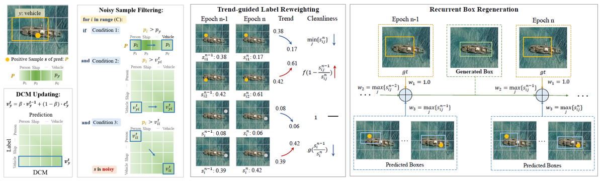
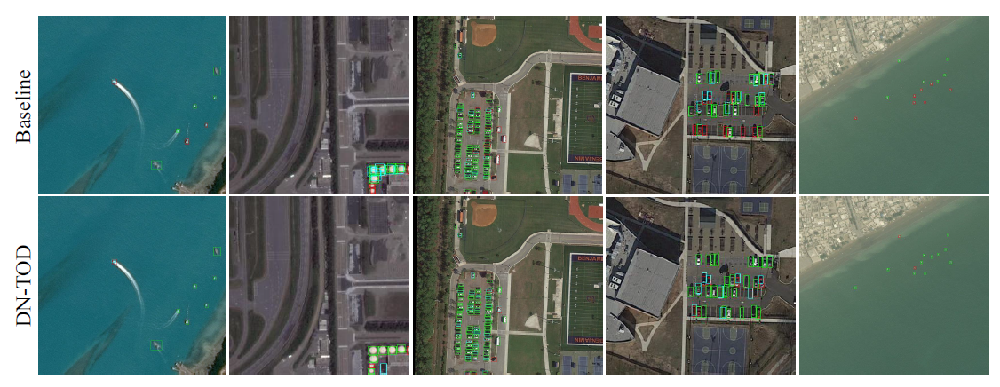

# Robust Tiny Object Detection in Aerial Images amidst Label Noise
This is the official implementation of the paper "Robust Tiny Object Detection in Aerial Images amidst Label Noise". [arxiv](https://arxiv.org/abs/2401.08056)

## :white_check_mark: Updates
* **`May. 21th, 2024`**: Update: **Important!** we release the **noisy datasets** and **FCOS w/ DN-TOD** model.
* **`Aug. 11th, 2024`**: Update: we have made **all training configuration** files publicly available! These files include OAMIL, SSDDet, and Faster R-CNN w/ DN-TOD!
* **`Aug. 11th, 2025`**: **If you have any questions, feel free to ask !!! If you need any model code related to the paper, please feel free to leave a message in the Issue section or email me at zhuhaoran@whu.edu.cn. I will respond promptly.**

## Introduction
DN-TOD is an effective denoising algorithm that can be integrated into either one-stage or two-stage algorithms to enhance the network's robustness against noise.

**Abstract**: Precise detection of tiny objects in remote sensing imagery remains a significant challenge due to their limited visual information and frequent occurrence within scenes. This challenge is further exacerbated by the practical burden and inherent errors associated with manual annotation: annotating tiny objects is laborious and prone to errors (i.e., label noise). Training detectors for such objects using noisy labels often leads to suboptimal performance, with networks tending to overfit on noisy labels. In this study, we address the intricate issue of tiny object detection under noisy label supervision. We systematically investigate the impact of various types of noise on network training, revealing the vulnerability of object detectors to class shifts and inaccurate bounding boxes for tiny objects. To mitigate these challenges, we propose a DeNoising Tiny Object Detector (DN-TOD), which incorporates a Class-aware Label Correction (CLC) scheme to address class shifts and a Trend-guided Learning Strategy (TLS) to handle bounding box noise. CLC mitigates inaccurate class supervision by identifying and filtering out class-shifted positive samples, while TLS reduces noisy box-induced erroneous supervision through sample reweighting and bounding box regeneration. Additionally, Our method can be seamlessly integrated into both one-stage and two-stage object detection pipelines. Comprehensive experiments conducted on synthetic (i.e., noisy AI-TOD-v2.0 and DOTA-v2.0) and real-world (i.e., AI-TOD) noisy datasets demonstrate the robustness of DN-TOD under various types of label noise. Notably, when applied to the strong baseline RFLA, DN-TOD exhibits a noteworthy performance improvement of 4.9 points under 40% mixed noise.

<div align=center>

</div>

## Method


## Installation and Get Started
[](https://www.python.org/)
[](https://pytorch.org/)

Required environments:
* Linux
* Python 3.6+
* PyTorch 1.3+
* CUDA 9.2+
* GCC 5+
* [MMCV](https://mmcv.readthedocs.io/en/latest/#installation)
* [cocoapi-aitod](https://github.com/jwwangchn/cocoapi-aitod)
* [RFLA](https://github.com/Chasel-Tsui/mmdet-rfla)

Install:

Note that this repository is based on the [MMDetection](https://github.com/open-mmlab/mmdetection). Assume that your environment has satisfied the above requirements, please follow the following steps for installation.

```shell script
git clone https://github.com/ZhuHaoranEIS/DN-TOD.git
cd DN-TOD
pip install -r requirements/build.txt
python setup.py develop
```
## Main Contributions

- We investigate the impact of different types of label noise in tiny object detection
- We propose a DeNoising Tiny Object Detector (DNTOD) that performs robust object detection under label noise.

## Prepare datasets

- Please refer to [AI-TOD](https://github.com/Chasel-Tsui/mmdet-aitod) for AI-TOD-v2.0 and AI-TOD-v1.0 dataset.

```shell
DN-TOD
├── configs
├── data
│   ├── AI-TOD-v2
│   │   ├── annotations
│   │   │    │─── aitod_training.json
│   │   │    │─── aitod_validation.json
│   │   ├── train
│   │   │    │─── ***.png
│   │   │    │─── ***.png
│   │   ├── val
│   │   │    │─── ***.png
│   │   │    │─── ***.png
├── mmdet
```
- Generate noisy annotations:

``` shell
# generate noisy AI-TOD-v2.0 (e.g., 10%-40% all types of noise)
'''
  noise_level:
  0.1, 0.2, 0.3, 0.4 ...
  noise_type:
  first:  missing labels
  second: inaccurate bounding boxes
  third:  class shifts
  forth:  extra labels
  st:     inaccurate bounding boxes + class shifts
  all:    missing labels + inaccurate bounding boxes + class shifts + extra labels
'''

python tools/noise_generator/inject_noise.py --noise-level 0.1 0.2 0.3 0.4 \
--noise-types first second third forth st all \
--clean-path /home/zhuhaoran/DN-TOD/tools/noise_generator/clean_json/aitodv2_train.json \
--store-path /home/zhuhaoran/DN-TOD/tools/noise_generator/noisy_json

```

## Noise Influence

<div align=center>

</div>

## Training

All models of DN-TOD are trained with a total batch size of 1 (can be adjusted following [MMDetection](https://github.com/open-mmlab/mmdetection)). 

- To train DN-TOD on AI-TOD-v2.0, run

```shell script
# For inaccurate bounding boxes under 10% noise
python tools/train.py inaccurate_bounding_boxes/noise_0.1.py --gpu-id 0

# For class shifts under 10% noise
python tools/train.py class_shifts/noise_0.1.py --gpu-id 0

# For mixed noise under 10% noise
python tools/train.py mixed/noise_0.1.py --gpu-id 0

```
Please refer to 
[inaccurate_bounding_boxes/noise_0.1.py](https://github.com/ZhuHaoranEIS/DN-TOD/blob/main/configs/DN-TOD-FCOS/inaccurate_bounding_boxes_noise/noise_0.1.py),  
[class_shifts/noise_0.1.py](https://github.com/ZhuHaoranEIS/DN-TOD/blob/main/configs/DN-TOD-FCOS/class_shifts_noise/noise_0.1.py), 
[mixed_shifts/noise_0.1.py](https://github.com/ZhuHaoranEIS/DN-TOD/blob/main/configs/DN-TOD-FCOS/mixed_noise/noise_0.1.py)
for model configuration

## Inference

- Modify [test.py](https://github.com/ZhuHaoranEIS/DN-TOD/blob/main/tools/test.py)

```/path/to/model_config```: modify it to the path of model config, e.g., ```.configs/DN-TOD-FCOS/inaccurate_bounding_boxes_noise/noise_0.1.py```

```/path/to/model_checkpoint```: modify it to the path of model checkpoint


- Run
```
python tools/test.py inaccurate_bounding_boxes/noise_0.1.py /path/to/model_checkpoint --eval bbox
```

## Main results
Table 1. Performance of baseline methods and our proposed method on the [AI-TOD-v2.0](https://github.com/jwwangchn/AI-TOD) **Validation Set:** under different levels of class shifts. *means using [RFLA](https://github.com/Chasel-Tsui/mmdet-rfla) in the label assignment. Abbreviations are used to define different categories.
| **Noise Level**       | **Method**                        | **VE**        | **SH**        | **PE**       | **ST**        | **SP**        | **AI**        | **BR**        | **WH**       | **mAP**       |
|-----------------------|-----------------------------------|---------------|---------------|--------------|---------------|---------------|---------------|---------------|--------------|---------------|
|          0%           | FCOS*                             | 24.5          | 43.5          | 4.5          | 29.9          | 4.7           | 0.9           | **17.4**      | 1.1          | 15.8          |
|                       | Faster R-CNN*                     | **24.9**      | 25.0          | 6.3          | 37.3          | **17.1**      | **8.9**       | 12.2          | 4.3          | 17.0          |
|                       | FCOS* w/ CLC                      | 24.7          | **44.3**      | 5.0          | 31.2          | 7.4           | 2.1           | 16.3          | 2.6          | 16.7          |
|                       | Faster R-CNN* w/ CLC              | 24.8          | 25.5          | **6.9**      | **37.8**      | 16.3          | 7.7           | 12.9          | **4.9**      | **17.1**      |
|          10%          | FCOS*                             | 24.5          | 43.1          | 4.7          | 29.7          | 6.5           | 0.0           | 18.7          | **5.0**      | 16.5          |
|                       | Faster R-CNN*                     | 22.3          | 23.6          | 5.4          | 34.6          | 18.1          | 7.8           | 11.3          | 3.9          | 15.9          |
|                       | FCOS* w/ CLC                      | **25.1**      | **44.0**      | 5.1          | 30.4          | 7.4           | 0.0           | **19.5**      | 3.4          | 16.8          |
|                       | Faster R-CNN* w/ CLC              | 23.6          | 25.0          | **6.1**      | **36.6**      | **18.7**      | **12.1**      | 11.4          | 3.2          | **17.1**      |
|          20%          | FCOS*                             | 24.3          | 41.6          | 4.4          | 30.7          | 0.3           | 0.0           | 17.0          | 1.1          | 14.9          |
|                       | Faster R-CNN*                     | 21.7          | 22.6          | 4.6          | 33.0          | 18.0          | 8.6           | 13.0          | **3.9**      | 15.7          |
|                       | FCOS* w/ CLC                      | **24.5**      | **43.2**      | 4.6          | 30.7          | 0.2           | 0.0           | **18.7**      | 2.7          | 15.6          |
|                       | Faster R-CNN* w/ CLC              | 23.5          | 24.4          | **5.9**      | **36.7**      | **20.5**      | **9.6**       | 11.0          | 3.1          | **16.9**      |
|          30%          | FCOS*                             | 24.7          | 40.0          | 4.2          | 28.6          | 0.3           | 0.0           | 16.6          | 2.2          | 14.6          |
|                       | Faster R-CNN*                     | 21.3          | 23.5          | 5.2          | 31.6          | **20.0**      | 7.6           | 9.4           | 3.7          | 15.3          |
|                       | FCOS* w/ CLC                      | **24.7**      | **43.3**      | 4.7          | 29.9          | 0.1           | 0.0           | **17.0**      | 0.0          | 15.0          |
|                       | Faster R-CNN* w/ CLC              | 23.7          | 24.8          | **5.9**      | **37.1**      | 19.6          | **8.8**       | 11.6          | **3.9**      | **16.9**      |
|          40%          | FCOS*                             | 24.2          | 38.3          | 3.9          | 27.0          | 0.0           | 0.0           | 16.2          | 0.0          | 13.7          |
|                       | Faster R-CNN*                     | 20.9          | 21.5          | 4.1          | 31.0          | 15.2          | 8.2           | 9.3           | **2.8**      | 14.1          |
|                       | FCOS* w/ CLC                      | **24.6**      | **41.7**      | 4.4          | 28.7          | 0.2           | 0.0           | **17.6**      | 0.0          | 14.7          |
|                       | Faster R-CNN* w/ CLC              | 23.4          | 24.1          | **5.9**      | **36.4**      | **20.0**      | **8.7**       | 12.4          | 2.3          | **16.6**      |

Table 2. Performance of baseline methods and our proposed method on the [AI-TOD-v2.0](https://github.com/jwwangchn/AI-TOD) **Validation Set:** under different levels of inaccurate bounding boxes.
| **Stages**                         | **Method**                             | **Clean**     |  **Noisy**                          |**Noisy**      |   **Noisy**   | **Noisy**     |
|------------------------------------|----------------------------------------|---------------|-------------------------------------|---------------|---------------|---------------|
|                                    |                                        | **0%**        | **10%**                             | **20%**       | **30%**       | **40%**       |
| One-stage Methods                  | FCOS*                                  | 34.9          | 34.7                                | 30.2          | 24.3          | 18.4          |
|                                    | Free Anchor                            | 20.1          | 19.2                                | 14.2          | 9.3           | 7.2           |
|                                    | Gaussian yolov3                        | 34.6          | 32.2                                | 28.2          | --            | --            |
|                                    | Wise-IoU                               | 35.7          | 36.6                                | 30.8          | 23.7          | 16.8          |
|                                    | Generalized Focal Loss                 | 37.6          | 36.9                                | 33.9          | 26.6          | 14.9          |
|                                    | FCOS* w/ TLS                           | **41.0**      | **39.8**                            | **37.4**      | **32.1**      | **21.3**      |
| Two-stage Methods                  | Faster R-CNN*                          | 45.0          | 44.0                                | 39.3          | 29.0          | 15.4          |
|                                    | KL-Loss                                | **48.8**      | 45.7                                | 38.2          | 26.5          | 15.9          |
|                                    | OA-MIL                                 | 46.0          | 42.7                                | 39.3          | 28.5          | 15.0          |
|                                    | DISCO                                  | 47.1          | 45.8                                | **40.7**      | 29.0          | 17.5          |
|                                    | Faster R-CNN* w/ TLS                   | 47.3          | **46.1**                            | 39.5          | **31.9**      | **19.2**      |


Table 3. Performance of baseline methods and our proposed method on the [AI-TOD-v2.0](https://github.com/jwwangchn/AI-TOD) **Validation Set:** under different levels of mixed noise.
| **Stages**                         | **Method**                             | **Clean**     | **Noisy**                           |**Noisy**      | **Noisy**     |**Noisy**      |
|------------------------------------|----------------------------------------|---------------|-------------------------------------|---------------|---------------|---------------|
|                                    |                                        | **0%**        | **10%**                             | **20%**       | **30%**       | **40%**       |
|  One-stage Methods                 | FCOS*                                  | 34.9          | 33.0                                | 28.5          | 24.9          | 12.7          |
|                                    | Wise-IoU                               | 35.7          | 32.9                                | 28.9          | 23.1          | 13.1          |
|                                    | Generalized Focal Loss                 | 37.6          | 33.7                                | 29.3          | 24.0          | 13.5          |
|                                    | DN-TOD                                 | **38.1**      | **34.2**                            | **31.4**      | **27.2**      | **17.6**      |
|  Two-stage Methods                 | Faster R-CNN*                          | 45.0          | 43.7                                | 33.0          | 24.2          | 12.8          |
|                                    | OA-MIL                                 | 46.0          | 44.4                                | 36.6          | 26.4          | 13.1          |
|                                    | DISCO                                  | **47.1**      | 43.4                                | 35.2          | 22.4          | 11.2          |
|                                    | DN-TOD                                 | 45.5          | **45.3**                            | **38.1**      | **29.1**      | **16.2**      |

Table 4. Performance of baseline methods and our proposed method on the real world noisy dataset.
| Method      | mAP           | $\rm{AP_{0.5}}$ | $\rm{AP_{vt}}$ | $\rm{AP_{t}}$ | $\rm{AP_{s}}$ | $\rm{AP_{m}}$ |
|-------------|---------------|-----------------|----------------|---------------|---------------|---------------|
| Noisy-FCOS* | 14.8          | 32.6            | 6.7            | 16.9          | 16.3          | 19.1          |
| DN-TOD      | **15.5**      | **34.9**        | **6.8**        | **17.8**      | **16.3**      | **19.4**      |
| Clean-FCOS* | 15.8          | 34.9            | 7.1            | 18.1          | 16.9          | 19.7          |


## Visualization
The images are from the AI-TOD-v2.0 datasets. Note that the <font color=green>green box</font> denotes the True Positive, the <font color=red>red box</font> denotes the False Negative and the <font color=blue>blue box</font> denotes the False Positive predictions.


## Citation
If you find this work helpful, please consider citing:
```bibtex
@misc{zhu2024robust,
      title={Robust Tiny Object Detection in Aerial Images amidst Label Noise}, 
      author={Haoran Zhu and Chang Xu and Wen Yang and Ruixiang Zhang and Yan Zhang and Gui-Song Xia},
      year={2024},
      eprint={2401.08056},
      archivePrefix={arXiv},
      primaryClass={cs.CV}
}
```

